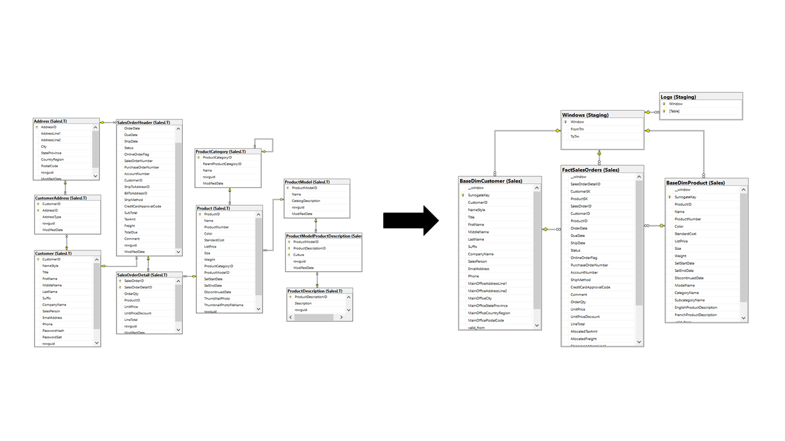

# Hi, I am Diego Alvarado

I am a student of Information Engineering at Pacifico University, Peru.
My principal area of interest is data engineering. 
My abilities include Python and Scala programming, distributed computing with Spark, 
Power BI and services of the Azure Data Platform (SQL Database, Databricks, Data Factory).

## Achievements

- **Third place in Latin America at the DataJam Pasos Libres 2020 (LawIT team)**: 
This competition had the goal of developing solutions to face human trafficking. 
To this end, a predictive model was developed to forecast the number of reported 
human trafficking cases in each of the peruvian regions for each year taking as 
inputs a number of socioeconomic indicators.
[link](https://fundacionpasoslibres.org/primera-datajam-mundial-contra-la-trata-de-personas/)

## Certifications

- **Databricks Certified Spark Developer (July 7, 2022)**: assesses the understanding of the Spark 
DataFrame API and the ability to apply the Spark DataFrame API to complete basic 
data manipulation tasks within a Spark session; and the basics of the Spark 
architecture like execution/deployment modes, the execution hierarchy, 
fault tolerance, garbage collection, and broadcasting.
[link](https://credentials.databricks.com/e5a9ae79-1f02-4df5-b7ac-ec8287d8ca87)

- **Databricks Certified Advanced Data Engineer (September 22, 2022)**:  assesses the ability to perform 
advanced data engineering tasks. This includes an understanding of the Databricks 
platform and developer tools like Apache Spark, Delta Lake, MLflow, and the 
Databricks CLI and REST API. It also assesses the ability to build optimized and 
cleaned ETL pipelines. 
[link](https://credentials.databricks.com/d3a7698e-0371-4743-ac1a-b66099ef0f0f)

## Online Education

- **Functional Programming in Scala (June 16, 2020)**: This Coursera specialization begins from the basic building blocks of the functional paradigm and then builds up to combining these concepts to architect larger functional programs. It also explores parallel programming on multicore architectures and distibuted programming on a cluster using Apache Spark. [link](https://www.coursera.org/account/accomplishments/specialization/certificate/DZJPBXRTZS6L)

## Sample Projects

- ### Adventure Works LT Data Warehouse

Data Warehouse for the Adventure Works LT database implemented using Azure SQL 
Database and Data Factory. 
[link](https://github.com/DiegoAlvaradoRivera/AdvWorksLTDW)

- ### Fire Department Calls Dashboard

PBI dashboard for the Fire Department Calls dataset. The data cleaning and 
modelling steps are implemented using Spark and the report using Power BI in 
import mode. 
[link](https://github.com/DiegoAlvaradoRivera/FireDepartmentCallsPBIDashboard)

